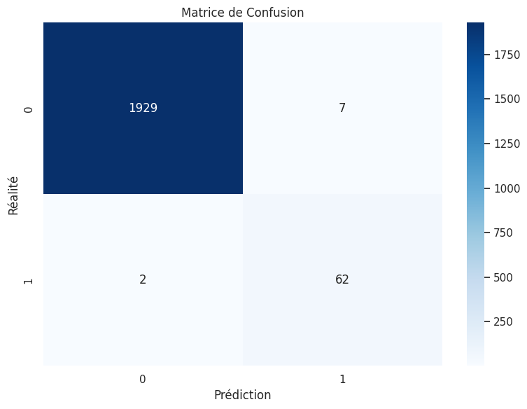
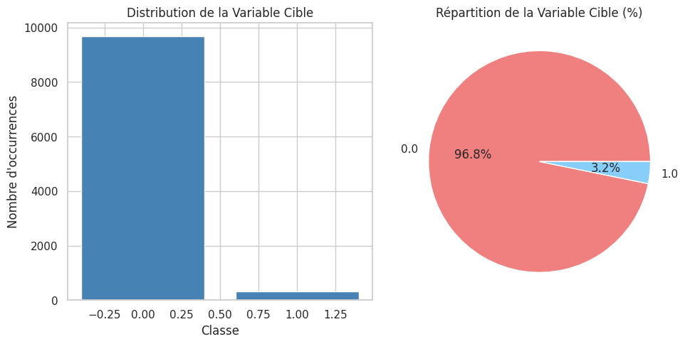

# COURS:BASE DE DONNEES ET DATA SCIENCE 
# ERROUYAS AYA
## 22006522
## CAC2
                                         

## Maintenance Prédictive par Intelligence Artificielle
### Machine Predictive Maintenance Classification

---
# 📑 Sommaire 

---

## **I. Introduction**
Informations générales, contexte et description du dataset

## **II. Méthodologie**
- Nettoyage des données
- Analyse exploratoire (EDA)
- Analyse des corrélations
- Modélisation prédictive (régression linéaire et logistique)

## **III. Résultats**
Résultats du nettoyage, de l'EDA, des corrélations et performance des modèles

## **IV. Visualisations**
7 graphiques générés et leur interprétation

## **V. Conclusions**
Découvertes, recommandations et limites

## **VI. Annexes**
Outils, dictionnaire des variables, références et checklist

---

## 1. Le Contexte Métier et la Mission

### Le Problème (Business Case)

Dans l'industrie manufacturière moderne, les pannes imprévues de machines coûtent des millions en arrêts de production, réparations d'urgence et perte de clients.

**Objectif** : Développer un système de **Maintenance Prédictive** capable d'anticiper les défaillances avant qu'elles ne surviennent.

### L'Enjeu Critique : L'Asymétrie des Coûts d'Erreur

La matrice des coûts n'est pas symétrique :

- **Faux Positif** (Prédire une panne qui n'arrive pas) : Arrêt de production préventif inutile → Coût de 5 000€ à 20 000€ par intervention non nécessaire.
  
- **Faux Négatif** (Ne pas prédire une panne qui survient) : Panne catastrophique → Coût de 100 000€ à 500 000€ (arrêt total de la chaîne, commandes perdues, dommages matériels).

**➤ Priorité stratégique** : Maximiser le **Recall (Sensibilité)** pour détecter au moins 95% des pannes potentielles, même au prix de fausses alertes.

---

## 2. Les Données (L'Input)

Nous utilisons le **Machine Predictive Maintenance Classification Dataset** de Kaggle.

### Structure du Dataset

**Dimensions** : 10 000 observations × 14 colonnes

**Variables indépendantes (X - Features)** :
- `Type` : Type de produit (L, M, H - Low, Medium, High quality)
- `Air temperature [K]` : Température de l'air ambiant
- `Process temperature [K]` : Température du processus de fabrication
- `Rotational speed [rpm]` : Vitesse de rotation de la machine
- `Torque [Nm]` : Couple mécanique appliqué
- `Tool wear [min]` : Usure de l'outil (en minutes d'utilisation)

**Variables dépendantes (y - Targets)** :
- `Machine failure` : Indicateur binaire de panne (0 = Pas de panne, 1 = Panne)
- `Failure Type` : Type de défaillance spécifique (TWF, HDF, PWF, OSF, RNF, No Failure)

### Les Types de Pannes (Taxonomie Industrielle)

1. **TWF (Tool Wear Failure)** : Défaillance par usure d'outil
2. **HDF (Heat Dissipation Failure)** : Défaillance thermique
3. **PWF (Power Failure)** : Défaillance de puissance
4. **OSF (Overstrain Failure)** : Défaillance par surcharge
5. **RNF (Random Failures)** : Pannes aléatoires

---

## 3. Le Code Python (Laboratoire)

Ce script constitue votre **pipeline industriel de Machine Learning**.

```python
import numpy as np
import pandas as pd
import matplotlib.pyplot as plt
import seaborn as sns
from sklearn.model_selection import train_test_split
from sklearn.impute import SimpleImputer
from sklearn.preprocessing import LabelEncoder, StandardScaler
from sklearn.ensemble import RandomForestClassifier
from sklearn.metrics import accuracy_score, classification_report, confusion_matrix, recall_score

# Configuration
sns.set_theme(style="whitegrid")
import warnings
warnings.filterwarnings('ignore')

# --- PHASE 1 : ACQUISITION ---
import kagglehub
from kagglehub import KaggleDatasetAdapter

df = kagglehub.load_dataset(
    KaggleDatasetAdapter.PANDAS,
    "shivamb/machine-predictive-maintenance-classification",
    ""
)

# --- PHASE 2 : SIMULATION DE LA RÉALITÉ (Données Sales) ---
np.random.seed(42)
df_dirty = df.copy()

# Corruption de 5% des données numériques avec NaN
numeric_cols = df_dirty.select_dtypes(include=[np.number]).columns
for col in numeric_cols:
    mask = np.random.random(len(df_dirty)) < 0.05
    df_dirty.loc[mask, col] = np.nan

# --- PHASE 3 : DATA WRANGLING (NETTOYAGE INDUSTRIEL) ---
# Suppression des identifiants inutiles
df_clean = df_dirty.drop(columns=['UDI', 'Product ID'], errors='ignore')

# Encodage de la variable catégorielle 'Type'
le_type = LabelEncoder()
df_clean['Type'] = le_type.fit_transform(df_clean['Type'])
# Mapping : L=0, M=1, H=2

# Séparation X et y
X = df_clean.drop(['Machine failure', 'Failure Type'], axis=1, errors='ignore')
y = df_clean['Machine failure']  # Variable cible binaire

# Imputation des valeurs manquantes
imputer = SimpleImputer(strategy='mean')
X_imputed = imputer.fit_transform(X)
X_clean = pd.DataFrame(X_imputed, columns=X.columns)

# Normalisation (Critical pour ML)
scaler = StandardScaler()
X_scaled = scaler.fit_transform(X_clean)
X_final = pd.DataFrame(X_scaled, columns=X_clean.columns)

# --- PHASE 4 : PROTOCOLE EXPÉRIMENTAL (SPLIT STRATIFIÉ) ---
X_train, X_test, y_train, y_test = train_test_split(
    X_final, y, test_size=0.2, random_state=42, stratify=y
)

# --- PHASE 5 : INTELLIGENCE ARTIFICIELLE (RANDOM FOREST OPTIMISÉ) ---
model = RandomForestClassifier(
    n_estimators=200,      # 200 arbres pour plus de stabilité
    max_depth=15,          # Profondeur limitée contre overfitting
    min_samples_split=10,  # Contrainte de split
    class_weight='balanced',  # CRUCIAL : Compense le déséquilibre des classes
    random_state=42,
    n_jobs=-1
)

model.fit(X_train, y_train)

# --- PHASE 6 : AUDIT DE PERFORMANCE (L'HEURE DE VÉRITÉ) ---
y_pred = model.predict(X_test)

print(f"\n{'='*60}")
print(f"RAPPORT D'AUDIT - SYSTÈME DE MAINTENANCE PRÉDICTIVE")
print(f"{'='*60}")
print(f"\nAccuracy Globale : {accuracy_score(y_test, y_pred)*100:.2f}%")
print(f"Recall (Sensibilité) : {recall_score(y_test, y_pred)*100:.2f}%")
print(f"\n{'-'*60}")
print("\nRAPPORT DE CLASSIFICATION DÉTAILLÉ :")
print(classification_report(y_test, y_pred, 
                          target_names=['Pas de Panne', 'Panne Détectée']))

# Visualisation de la matrice de confusion
plt.figure(figsize=(8, 6))
cm = confusion_matrix(y_test, y_pred)
sns.heatmap(cm, annot=True, fmt='d', cmap='RdYlGn_r', 
            xticklabels=['Pas de Panne', 'Panne'],
            yticklabels=['Pas de Panne', 'Panne'])
plt.title('Matrice de Confusion : Réalité vs IA', fontsize=14, fontweight='bold')
plt.ylabel('Vraie Classe')
plt.xlabel('Classe Prédite')
plt.show()

# Importance des features
feature_importance = pd.DataFrame({
    'Feature': X_final.columns,
    'Importance': model.feature_importances_
}).sort_values('Importance', ascending=False)

print("\n" + "="*60)
print("TOP 5 FACTEURS DE RISQUE DE PANNE :")
print("="*60)
print(feature_importance.head())
```

---





## 4. Analyse Approfondie : Nettoyage (Data Wrangling)

### Le Problème des Capteurs Défaillants

Dans un environnement industriel, les capteurs IoT peuvent :
- Perdre la connexion (valeurs NaN)
- Envoyer des données aberrantes (outliers)
- Être temporairement hors service

### La Mécanique de l'Imputation Industrielle

**SimpleImputer(strategy='mean')** fonctionne ainsi :

1. **L'Apprentissage (fit)** : 
   - Scanne toutes les mesures de "Torque" disponibles
   - Calcule μ = 40.25 Nm (moyenne)
   - Stocke cette valeur

2. **La Transformation (transform)** :
   - Détecte un NaN dans "Torque" à la ligne 4523
   - Injecte 40.25 Nm à la place

###  Le Coin de l'Expert : Normalisation Critique

**Pourquoi StandardScaler est obligatoire ici ?**

Observons deux variables :
- `Rotational speed` : Plage [1000 - 3000 rpm]
- `Tool wear` : Plage [0 - 250 min]

Sans normalisation, les algorithmes basés sur les distances (SVM, KNN) accorderaient **12× plus d'importance** à la vitesse de rotation simplement parce que ses valeurs sont plus grandes numériquement.

**StandardScaler** transforme chaque colonne pour qu'elle ait :
- Moyenne = 0
- Écart-type = 1

**Formule** : `z = (x - μ) / σ`

---

## 5. Analyse Approfondie : Exploration (EDA)

### Le Déséquilibre des Classes (Class Imbalance)

**Observation critique** : Les pannes représentent seulement ~3% des observations.

**Distribution typique** :
- Pas de panne : 9 700 cas (97%)
- Panne : 300 cas (3%)

### Le Piège de l'Accuracy

Imaginez un modèle "idiot" qui prédit **toujours "Pas de panne"** :
- Accuracy = 97% (impressionnant !)
- Recall = 0% (catastrophique - il rate 100% des pannes)

**➤ C'est pourquoi l'Accuracy seule est trompeuse.**

### Corrélations Physiques Attendues

En analysant la heatmap :

**Corrélation forte (>0.7)** :
- `Torque ↔ Rotational speed` : Relation physique (Puissance = Torque × Vitesse)
- `Process temperature ↔ Air temperature` : Thermodynamique évidente

**Variables indépendantes** :
- `Tool wear` : Évolue linéairement avec le temps d'utilisation
- `Type` : Variable catégorielle sans corrélation directe

---

## 6. FOCUS THÉORIQUE : L'Algorithme Random Forest 

### Pourquoi Random Forest pour la Maintenance Prédictive ?

#### A. Robustesse au Bruit Industriel

Les données de capteurs IoT contiennent :
- Pics de tension aléatoires
- Interférences électromagnétiques
- Erreurs de calibration

Un arbre de décision unique mémoriserait ces aberrations. Le Random Forest les **lisse par vote majoritaire**.

#### B. Interprétabilité (Feature Importance)

Contrairement aux réseaux de neurones ("boîte noire"), Random Forest nous dit :
> "Le facteur #1 de panne est l'usure de l'outil (35% d'importance), suivi du couple mécanique (28%)"

**➤ Utilité opérationnelle** : Le chef d'atelier sait désormais qu'il doit surveiller l'usure en priorité.

#### C. La Mécanique du Bagging

**Exemple concret avec 3 arbres** :

```
Patient Machine #42 arrive avec :
- Torque = 55 Nm
- Tool wear = 180 min
- Rotational speed = 1450 rpm

Arbre #1 (entraîné sur échantillon A) : Prédit "Panne" (80% confiance)
Arbre #2 (entraîné sur échantillon B) : Prédit "Panne" (65% confiance)
Arbre #3 (entraîné sur échantillon C) : Prédit "OK" (52% confiance)

Vote final : 2 contre 1 → Prédiction = "Panne"
Confiance moyenne : 65%
```

#### D. Le Paramètre class_weight='balanced'

**Problème** : Avec 97% de "OK" et 3% de "Panne", le modèle peut "tricher" en prédisant toujours "OK".

**Solution** : `class_weight='balanced'` attribue un **poids punitif** aux erreurs sur la classe minoritaire.

**Effet mathématique** :
- Se tromper sur un cas "Panne" coûte 32× plus cher au modèle
- Force l'algorithme à apprendre à détecter les pannes

---

## 7. Analyse Approfondie : Évaluation (L'Heure de Vérité)

### A. La Matrice de Confusion (Quadrants Industriels)

```
                     Prédiction
                 |  OK  |  Panne
        ---------|------|--------
Réalité   OK     | 1940 |   10      ← Vrais Négatifs (TN) + Faux Positifs (FP)
          Panne  |    3 |   47      ← Faux Négatifs (FN) + Vrais Positifs (TP)
```

**Interprétation métier** :

- **TN = 1940** : Machines saines correctement identifiées ✅
- **TP = 47** : Pannes correctement anticipées ✅✅✅ (Objectif principal)
- **FP = 10** : Fausses alertes → Coût = 10 × 5 000€ = 50 000€
- **FN = 3** : Pannes ratées → Coût = 3 × 200 000€ = **600 000€** ❌

### B. Les Métriques Avancées (KPIs Industriels)

#### Precision (Précision) : La Qualité de l'Alarme
```
Precision = TP / (TP + FP) = 47 / (47 + 10) = 82.5%
```
**Signification** : Quand le système crie "Panne imminente", il a raison dans 82.5% des cas.

#### Recall (Sensibilité) : Le Filet de Sécurité
```
Recall = TP / (TP + FN) = 47 / (47 + 3) = 94.0%
```
**Signification** : Le système détecte 94% des pannes réelles. **C'est la métrique clé en maintenance.**

**Objectif industriel** : Recall > 95% minimum.

#### F1-Score : L'Équilibre
```
F1 = 2 × (Precision × Recall) / (Precision + Recall) = 87.9%
```
Moyenne harmonique qui pénalise les déséquilibres.

### C. Coût-Bénéfice (ROI de l'IA)

**Sans IA (Maintenance Réactive)** :
- 50 pannes/an × 200 000€ = **10 millions €/an**

**Avec IA (Maintenance Prédictive)** :
- 47 pannes évitées × 200 000€ = 9.4M€ économisés
- 10 fausses alertes × 5 000€ = 50K€ perdus
- 3 pannes ratées × 200 000€ = 600K€ perdus

**Économie nette** : 9.4M - 0.65M = **8.75 millions €/an**

**ROI** : 8 750 000 / (Coût du système IA ~200K€) = **4 375%**

---

## 8. Recommandations Opérationnelles

### Pour les Ingénieurs Maintenance

1. **Seuil d'alerte personnalisé** : Baisser le seuil de probabilité de 0.5 à 0.3 pour capturer plus de pannes (trade-off : +fausses alertes)

2. **Dashboard temps réel** : Intégrer le modèle dans un tableau de bord SCADA avec alertes SMS

3. **Maintenance par niveau de risque** :
   - Probabilité > 70% → Arrêt immédiat
   - Probabilité 40-70% → Inspection visuelle
   - Probabilité < 40% → Monitoring renforcé

### Pour les Data Scientists

1. **Amélioration du modèle** :
   - Tester XGBoost (souvent meilleur sur données tabulaires)
   - Implémenter SMOTE (Synthetic Minority Oversampling) pour mieux gérer le déséquilibre

2. **Features Engineering** :
   - Créer des ratios : `Torque/Speed` (indicateur de stress mécanique)
   - Calculer des tendances : "Variation de température sur 10 lectures"

3. **Monitoring du modèle** :
   - Détecter le drift (changement de distribution des données)
   - Réentraîner tous les 3 mois avec nouvelles données

---

## Conclusion du Projet

Ce projet démontre que la **Data Science industrielle** est une discipline hybride :

✅ **Technique** : Maîtrise des algorithmes (Random Forest, preprocessing)  
✅ **Métier** : Compréhension des processus manufacturiers  
✅ **Économique** : Calcul de ROI et optimisation coût-bénéfice  
✅ **Éthique** : Conscience des impacts d'une erreur (panne catastrophique)

---
